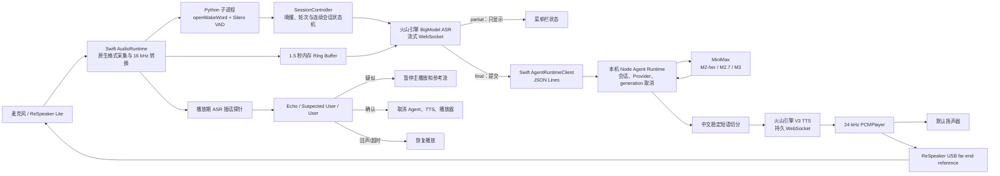

# TARST 项目全景进度与技术架构

> 盘点日期：2026-08-26<br>
> 当前分支：`codex/streaming-voice-agent`<br>
> 当前版本标识：`0.1.0`（开发原型）<br>
> 事实来源：当前工作区代码、自动测试、历史真实服务 smoke、诊断记录与 `HANDOFF.md`

## 1. 项目结论

TARST 目前已经从“唤醒词 + VAD 演示”发展为一个可以运行的原生 macOS 级联式 Voice Agent：用户能够用 “TARST” 或 “Hey TARST” 本地唤醒，语音经火山引擎转写，交给本机自研 Agent Runtime 调用 MiniMax，再将流式文本切成自然中文短语，通过火山引擎 TTS 合成并播放。

当前主链路已经打通：

```text
本地唤醒 → 本地 VAD → 火山流式 ASR → MiniMax 流式文本
→ 中文短语切分 → 火山流式 TTS → PCM 播放 → 30 秒连续会话
```

项目现在处于“功能闭环已建立、正在做低延迟和真人声学可靠性优化”的阶段，还不是可直接对外分发的生产版本。最主要的未完成项不是基础链路，而是：真人房间内的插话速度与成功率、连续多轮回答完整性统计、端到端延迟进一步压到 1.5 秒左右，以及正式签名、公证和自包含运行时。

### 当前阶段判断

| 领域 | 状态 | 结论 |
|---|---|---|
| 原生 macOS 菜单栏应用 | 已实现 | 可以常驻、设置、监听、暂停、诊断和登录启动 |
| 自定义唤醒词 | 开发阶段通过 | 两个 ONNX 模型可用，仍缺长期误唤醒与多设备统计 |
| VAD 与轮次收尾 | 已实现并优化 | 标点路径约 650 ms，普通静默路径 1.2 s |
| 流式 ASR | 已接入 | 真实火山 WebSocket 链路和 socket 竞态修复已验证 |
| 自研 Agent Runtime | 已接入 | Node 子进程、会话、流式 Provider、取消和安全协议可用 |
| MiniMax 模型 | 已接入 | 日常语音默认 M2-her，保留 M2.7-highspeed 与 M3 |
| 流式 TTS 与播放 | 已接入 | 持久 WebSocket、短语队列、PCM 真正 drain 检测可用 |
| 连续会话 | 已实现 | 一次唤醒后，每次回答结束均有 30 秒免唤醒追问窗口 |
| 回声抑制 | 已实现硬件参考路径 | ReSpeaker far-end reference + 文本回声判别；自动 smoke 通过 |
| 插话打断 | 已实现两阶段方案 | 可以先暂停、再确认或恢复；真人 p50/p95 尚未完成 |
| 凭据免重复授权 | 本机开发路径已修复 | 自签名构建使用本地加密保险库，正式签名预留 Data Protection Keychain |
| 工具调用、长期记忆 | 未实现 | 当前 Agent 只对话，没有真实副作用工具和长期记忆写入 |
| 声学情绪观察 | 仅完成设计 | `AcousticObservation` 边界已有设计，但生产链路尚未实现 |
| 外部分发 | 未完成 | 仍依赖本机 Node/Python 环境，尚未 Developer ID 签名、公证和安装器化 |

## 2. 产品形态

TARST 的主产品不是网页聊天框，而是原生 macOS 菜单栏常驻应用。

当前产品行为包括：

- 菜单栏显示“需要设置、待命、我在听、正在倾听、正在转写、正在回应、已暂停、需要注意”等状态。
- 支持开始/暂停监听、设置火山引擎和 MiniMax 凭据、导入两个唤醒模型、打开诊断目录和退出。
- 使用 `SMAppService` 注册登录后自动启动。
- App 始终是唯一的麦克风所有者，原始 PCM 只在内存中流转。
- 一次唤醒开启 companion 会话，回答结束后的 30 秒内可以直接继续说，不需要再次说 “Hey TARST”。
- 原网页原型仍保留在 `public/`，但不是当前语音运行时的主入口。

## 3. 总体技术架构



这是一条可审计、可替换组件的级联架构。TARST 自己拥有状态、会话、取消、未来工具权限和记忆策略；火山引擎与 MiniMax 只是能力供应商。

## 4. 技术栈总览

| 层 | 技术 | 当前用途 |
|---|---|---|
| macOS 应用 | Swift、AppKit，最低 macOS 14 | 菜单栏 UI、设置窗口、应用生命周期和 smoke 启动模式 |
| 音频采集 | AVFoundation / `AVAudioEngine` / `AVAudioConverter` | 以硬件原生格式采集，再在内存中转成单声道 16 kHz PCM |
| 音频设备控制 | CoreAudio、AudioToolbox | 指定 ReSpeaker Lite 输出为 AEC far-end reference |
| 系统能力 | ServiceManagement、Security、LocalAuthentication、IOKit | 登录启动、凭据访问、设备身份与本机保险库 |
| 本地唤醒 | openWakeWord `0.6.0`、自定义 ONNX 模型 | 识别 `TARST` 与 `Hey-TARST` |
| 本地 VAD | Silero VAD `6.2.0`、PyTorch/ONNX 运行时 | 计算语音概率，驱动开始说话和结束说话 |
| Python 桥 | Python 子进程 + stdin/stdout JSON | Swift 发送 PCM 帧，Python 返回唤醒分数与 VAD 概率 |
| ASR | 火山引擎 BigModel 流式 ASR V3 | 16 kHz Int16 mono PCM 的 partial/final 转写 |
| Agent Runtime | Node.js、ES Modules、自研 JSON Lines 协议 | 多轮历史、Provider 抽象、流式事件、取消与错误收束 |
| 模型 SDK | `openai` npm 包 `^7.4.0` + 原生 `fetch`/SSE | 调用 MiniMax OpenAI-compatible 和 M3 原生接口 |
| LLM | MiniMax M2-her、M2.7-highspeed、M3 | 日常低延迟对话与未来复杂任务路由 |
| 文本流处理 | Swift `ChineseSentenceChunker` | 将 token 流变成稳定、可朗读的中文短语 |
| TTS | 火山引擎 V3 双向流式 TTS | 输出 24 kHz、16-bit、单声道 PCM |
| 播放 | `AVAudioPlayerNode` | 边收边播、队列 drain、暂停/恢复与 generation 隔离 |
| 凭据 | Data Protection Keychain / AES-GCM 本地保险库 | 避免密钥泄露及本机自签名构建重复询问密码 |
| 诊断 | JSONL、Python 汇总脚本 | 记录无正文的状态和逐阶段延迟，计算 median/p95 |
| 测试 | Swift executable smoke、Node `node:test`、真实服务 smoke | 单元、协议、运行时、ASR/TTS、AEC、启动和端到端延迟验证 |
| 构建 | Swift Package Manager、shell、`codesign` | 生成并签名 `dist/TARST.app` |

## 5. 完整运行链路

### 5.1 App 启动与预热

用户点击“开始监听”后，`AudioRuntime` 会：

1. 检查麦克风、本地 Python 环境和两个 ONNX 唤醒模型。
2. 读取火山与 MiniMax 凭据，并缓存在当前 App 进程中。
3. 启动 Node Agent Runtime 子进程，通过 stdin 发送一次 `runtime.configure`。
4. MiniMax OpenAI-compatible Provider 对中国区 API host 做机会式预连接，提前完成 DNS/TCP/TLS。
5. 预热火山 TTS WebSocket，使之后的短语只创建逻辑 session，不重复建立底层连接。
6. 启动 Python 本地检测器和 Swift 麦克风采集。

普通的停止/重新开始监听会复用进程内凭据缓存；只有 App 重启或设置被保存/删除后才重新加载。

### 5.2 麦克风与本地检测

- `AVAudioEngine` 必须以输入设备的原生硬件格式安装 tap，避免 48 kHz 设备上的 Core Audio 格式异常。
- `AVAudioConverter` 将输入在内存中转换为单声道 16 kHz，再转成 Int16 PCM。
- 环形缓冲只保存最近 1.5 秒，既用于避免丢掉起始音节，也用于插话 pre-roll；不写入磁盘。
- 每 1280 个采样点形成一个 80 ms 帧，通过 stdin 交给 Python。
- openWakeWord 使用两个自定义 ONNX 模型，默认唤醒阈值为 `0.55`。
- Silero VAD 内部按 512 samples / 32 ms 处理，并将一个 80 ms 窗口内的最高概率返回 Swift；VAD 阈值为 `0.50`。

### 5.3 唤醒与轮次结束

状态机的主要参数：

| 参数 | 当前值 | 作用 |
|---|---:|---|
| 唤醒后等待开口 | 6 s | 超时后回到待命 |
| 唤醒词尾音静音门 | 160 ms | 防止唤醒词尾音被当成正文 |
| 有完整句末标点的尾静音 | 650 ms | 更快结束明确完整的句子 |
| 普通尾静音 | 1.2 s | 对自然停顿保持一定容忍度 |
| 单轮最长语音 | 45 s | 防止一轮无限占用 |
| 回答结束后的追问窗口 | 30 s | 无需再次唤醒即可继续对话 |
| 播放结束回声冷却 | 350 ms | 防止尾部扬声器回声开启幽灵轮次 |
| ASR pre-roll | 500 ms | 保留冷却期或检测回调前的用户开头 |

ASR partial 以 `。！？!?` 结尾且至少 4 个字符时使用 650 ms 快速收尾，否则使用 1.2 秒普通静默。相比早期固定 1.8 秒，明确句末路径理论减少约 1.15 秒，普通路径减少约 0.6 秒。

### 5.4 火山引擎流式 ASR

- WebSocket：`wss://openspeech.bytedance.com/api/v3/sauc/bigmodel`
- 输入：16 kHz、16-bit、单声道、未压缩 PCM。
- 配置：标点与 ITN 开启，结果类型为 full。
- VAD 决定轮次边界；ASR 不拥有 TARST 的状态机。
- 开始说话时先发送 500 ms 内存 pre-roll，再实时发送 PCM。
- 结束时把 final packet 严格排在所有音频包之后。
- 配置包、PCM 和 finish 通过串行状态队列发送，并等待 WebSocket `didOpen`，已修复连续插话时的 POSIX socket 57 竞态。
- partial 只用于界面与 endpoint 判断；只有 final 才进入 Agent。
- 单轮 ASR 网络失败不会杀死整个监听进程，而是回到 30 秒追问窗口让用户重说。

### 5.5 Swift 与 Node Agent Runtime

`AgentRuntimeClient` 启动本机 Node 子进程，双方使用一行一个 JSON 对象的协议。主要事件包括：

```text
runtime.ready
runtime.configure / runtime.configured
turn.submit
agent.text_delta / agent.text_completed / agent.completed
agent.stream_diagnostic / agent.failed
generation.cancel / agent.cancelled
```

每一轮都携带：

- `session_id`：一次连续会话；
- `turn_id`：当前用户轮；
- `generation_id`：当前模型/TTS/播放代次。

generation ID 是整个取消机制的核心：旧模型、旧 ASR socket、旧 TTS 和旧播放器回调到达时，都必须先验证身份。这样可以阻止“上一轮迟到事件取消下一轮”或“旧播放完成回调提前结束新回答”。

当前 Runtime 已有：

- session 内的用户/助手文本历史；
- Provider 抽象；
- 流式文本事件；
- `AbortController` 取消；
- M3 SSE 帧归一化和安全超时；
- 不含正文的模型流元数据诊断；
- 对外只返回安全错误信息。

当前 Runtime 尚没有：

- 真实工具注册和 tool-calling 循环；
- 权限策略与高风险操作确认；
- 长期记忆数据库与用户确认写入；
- 多 Agent、计划器、Cron 或主动任务；
- 已落地的 `AcousticObservation` 输入。

### 5.6 MiniMax 模型路由

| Provider ID | 模型 | 当前角色 |
|---|---|---|
| `minimax_m2_her` | M2-her | 默认日常语音模型，首 token 与长尾目前最好 |
| `minimax_m27_highspeed` | MiniMax-M2.7-highspeed | 保留的快速/复杂任务候选 |
| `minimax_m25_highspeed` | MiniMax-M2.5-highspeed | A/B 基准候选 |
| `minimax_m21_highspeed` | MiniMax-M2.1-highspeed | A/B 基准候选 |
| `minimax_m3` | MiniMax-M3 | 原生 SSE Provider，未来复杂规划候选 |

OpenAI-compatible 基址为 `https://api.minimaxi.com/v1`。M3 使用其下的原生 `text/chatcompletion_v2` 流接口。当前 system prompt 要求回答简洁、自然、适合朗读，并禁止把不确定的声学线索描述成用户情绪事实。

M3 Provider 还实现了首数据 15 秒、流空闲 15 秒、整轮 90 秒的收束保护。早期“回答文本持续变化”经真实诊断证明并非模型修订流，真实主因是扬声器回声触发错误打断；不过累计/重复 SSE 快照归一化和超时保护仍被保留。

### 5.7 中文分句、TTS 与播放

模型文本不会等整段生成完成才朗读：

- 遇到 `。！？；` 或换行立即提交一个句子；
- 累积至少 12 个字符后，可在最早的 `，、：` 或空格处提交自然短语；
- 模型完成时 flush 剩余尾段；
- 禁止在词中间生硬切断。

火山 TTS：

- WebSocket：`wss://openspeech.bytedance.com/api/v3/tts/bidirection`
- 当前资源：Seed-TTS 2.0 配置；音色由用户设置保存。
- 输出：24 kHz、16-bit、单声道 PCM。
- App 启动时预热连接，连续短语复用底层 WebSocket。
- 每个短语独立建立 V3 session；若当前短语连接失败，会重连并最多重试一次。
- 首包偶发 “Socket is not connected” 有 5 次、每次 120 ms 的短重试保护。

播放器使用 `.dataPlayedBack` 判断 buffer 是否真的到达输出设备。TTS 网络 `sessionFinished` 只表示字节接收完，不等于用户已经听完；只有模型完成、TTS 队列为空、网络 session 结束并且 PCM 真正 drain，状态机才进入 follow-up。

### 5.8 连续会话

一次唤醒会创建 companion session：

```text
idle → 唤醒 → awaitingSpeech → listening → transcribing
→ responding → follow-up（30 秒）→ 下一轮 listening
```

每次回答完整播放后都会刷新 30 秒窗口。窗口内用户直接说话即可开始下一轮；超时后才重新回到只监听唤醒词的 `idle`。这解决了早期“每问一句都必须重新 Hey TARST”的问题。

## 6. 插话打断与回声抑制

### 6.1 为什么这是当前最困难的部分

TARST 一边用扬声器播放回答，一边持续监听用户。麦克风会同时收到：

- TARST 自己的扬声器回声；
- 房间反射后的延迟回声；
- 真正的用户插话；
- 两者重叠后的 ASR 累计文本。

简单使用 VAD 会把自己的回答当成人声，从而取消 TTS、开启新 ASR，再把自己的回答提交给模型。这正是早期回答被截断、文本似乎不断改变和出现感叹号的主要原因。

### 6.2 当前三层防线

1. **硬件 far-end reference**

   PCM 继续从 Mac 默认扬声器播放，同时复制一份完全相同的 PCM 到 ReSpeaker Lite USB 输出，供板载 XU316 AEC 作为远端参考。

2. **播放期 ASR 探针**

   VAD 检到重叠语音后，不立即永久取消，而是打开单独 ASR probe，并发送 500 ms pre-roll。长纯回声累计到 24 字且持续 2.5 秒时轮换 probe，防止回声前缀永远淹没后续用户语音。

3. **有状态文本判别**

   候选文本与当前已生成回答比较，结合连续 bigram、字符 LCS、最长可解释回声前缀和递进 partial，输出 `echo`、`undetermined`、`suspectedUser` 或 `user`。

### 6.3 两阶段可恢复打断

- 有明确回声 anchor 时，出现一次递进的新后缀即可进入“疑似用户”。
- 无 anchor 时，需要至少 12 字和两次递进证据才先暂停。
- 最终确认用户：有 anchor 需要两次递进；无 anchor 需要至少 18 字和四次递进。
- “停一下、等等、别说了”等明确短指令，在可信新后缀中可以更快确认。
- 疑似用户时同时暂停主扬声器与 ReSpeaker reference。
- 800 ms 内确认真人则取消 Agent、TTS 和播放器并转入下一轮。
- 若重新判断为 echo、probe final/failure 或超时，则自动恢复原回答。

这套机制优先保证回答完整和不自我打断；代价是普通自由文本插话仍可能偏慢。

### 6.4 当前插话证据

- 纯回声 AEC 压力测试曾连续 10/10 通过；最终 5/5 通过，且没有假暂停。
- 同一 Mac 扬声器注入“停一下”属于最坏、也不等价于真人的声学路径：最近 3 次为 2 次确认、1 次未确认。
- 一旦进入暂停，历史测试的暂停到最终确认约为 303/714 ms。
- 用户此前的体感是“现在大致可用，但打断反应较慢”。
- **真人从不同空间位置插话的候选→暂停、暂停→确认和总体 p50/p95 尚未形成足够样本，因此插话阶段不能判定最终完成。**

## 7. 延迟优化与当前基线

### 7.1 可重复基准方法

`EndToEndLatencySmokeTest` 使用真实火山 TTS 生成一条用户问题，将音频下采样为 16 kHz，再按真实时间以 80 ms 帧发送给火山 ASR；随后经过真实 MiniMax、中文短语切分和持久火山 TTS，测量用户音频结束到首个回复 PCM。

该测试使用真实网络、凭据和供应商服务，但不经过真实房间、麦克风和唤醒词，所以它是“可重复的网络级联基线”，不是最终真人体验数据。

### 7.2 M2-her 五轮基线

| 阶段 | median | p95 | 判断 |
|---|---:|---:|---|
| VAD 尾静默 | 680 ms | 682 ms | 标点路径稳定，已显著优于旧 1.8 s |
| ASR finish → final | 101 ms | 125 ms | 已低于 300 ms 目标 |
| Agent start → 首字 | 654 ms | 811 ms | 已低于 1.2 s p50 目标 |
| Agent start → 首个可朗读短语 | 783 ms | 814 ms | 12 字短语策略有效 |
| TTS request → 首音频 | 262 ms | 278 ms | 已低于 350 ms p50 目标 |
| 用户说完 → 首音频 | 1821 ms | 1866 ms | 已低于第一阶段 2.5 s 目标，尚未达到 1.5 s 追求 |

五次原始端到端样本为：`1686、1828、1821、1866、1620 ms`。

### 7.3 2026-08-26 提交前基线复测

稳定里程碑提交前重新运行了三轮相同的 M2-her 真实服务基准：

| 阶段 | median | p95 |
|---|---:|---:|
| VAD 尾静默 | 680 ms | 681 ms |
| ASR finish → final | 113 ms | 197 ms |
| Agent start → 首字 | 750 ms | 1394 ms |
| Agent start → 首个可朗读短语 | 750 ms | 1394 ms |
| TTS request → 首音频 | 268 ms | 298 ms |
| 用户说完 → 首音频 | 1897 ms | 2486 ms |

三次端到端样本为 `2486、1897、1792 ms`。其中一轮 MiniMax 首字为 1394 ms，说明典型响应仍约 1.8–1.9 秒，但小样本长尾仍会将整体推到约 2.5 秒；下一阶段需要继续针对模型首字和投机生成优化。三样本 p95 只用于提交时健康检查，不能取代前述五轮基线或未来真人大样本。

### 7.4 模型首字 A/B

| 模型 | median | p95 |
|---|---:|---:|
| M2-her | 582 ms | 785 ms |
| M2.7-highspeed | 713 ms | 1474 ms |
| M2.5-highspeed | 1467 ms | 1654 ms |
| M2.1-highspeed | 1335 ms | 1387 ms |

因此日常语音默认从 M3、再从 M2.7-highspeed，最终切换到 M2-her。M2.7 与 M3 没有删除，留作未来按复杂度路由。

### 7.5 已完成的延迟优化

- 固定尾静默从 1.8 s 降为普通 1.2 s、完整标点 650 ms。
- MiniMax API host 预连接。
- 日常模型切换为低首 token、低长尾的 M2-her。
- TTS 改为会话级持久 WebSocket，复用后首音频由历史约 510 ms 降到约 262 ms。
- 中文短语最早在自然边界且达到 12 字时提交，不再等待完整长句。
- 诊断增加 VAD、ASR final、首 token、首短语、TTS 首音频和端到端测点。
- 插话改为先暂停再确认，并记录候选→暂停、暂停→确认和总体确认延迟。

### 7.6 仍有潜力的优化

- 轻量语义 turn detector：把“停止发声”与“语义已经说完”拆开。
- 在高置信度 ASR partial 上投机启动 LLM；final 不一致时取消 generation。
- 按简单对话/复杂任务自动路由 M2-her、M2.7 与 M3。
- 使用流式声学 overlap classifier 取代当前依赖累计 ASR 文本的主要插话确认路径。
- 记录用户实际听到的音频位置，打断时同步裁剪模型历史。
- 对固定确认短语使用预合成音频缓存。
- 在保证完整性与误打断率不退化的前提下，继续向真人用户说完→首音频 p50 ≤ 1.5 s 推进。

## 8. 凭据、权限与隐私

### 8.1 保存的凭据

| 服务 | 标识 | 内容 |
|---|---|---|
| 火山语音 | `com.tarst.voice.volcengine` | App ID、Access Token、ASR/TTS Resource ID、Voice Type、可选 Cluster |
| MiniMax | `com.tarst.agent.minimax` | API Key |

凭据不会进入源码、Git、进程参数、环境变量或诊断正文。MiniMax Key 由 Swift 读取后只通过 Node 子进程 stdin 发送一次。

### 8.2 为什么以前会反复询问密码

早期 App 使用 ad-hoc 或不断变化的签名构建，macOS Keychain 会把每次构建视作不同身份；legacy login keychain 即使 ACL 看似正确，也可能在 `securityd` 解密时再次弹出登录密码。

当前方案：

- 正式 Apple Developer 签名构建优先使用 Data Protection Keychain。
- 本机自签名开发构建使用 `LocalCredentialVault`。
- 本地保险库使用 AES-GCM，加密材料绑定设备 UUID、当前 UID 与 service。
- 目录权限为 `0700`，文件权限为 `0600`。
- 固定本机签名身份为 `TARST Local Development`。
- 已有 legacy 用户迁移时可能需要最后一次授权；首次安装后直接配置的新用户不会依赖旧 login-keychain 路径。
- 凭据在 App 进程内缓存，切换监听不会重复读取。

历史签名 App 的两次连续 `--preflight-smoke` 与两次本地保险库 smoke 均通过且无密码提示。正式对外发行仍需要真正的 Developer ID、entitlements、公证和全新安装验证。

### 8.3 数据最小化

- 原始 PCM 和音频默认不落盘。
- ASR partial/final、用户正文和模型回复正文不写入诊断。
- 诊断只记录时间、状态、分数、长度、事件关系、错误 domain/code 和性能指标。
- 不自动推断心理健康状态。
- 当前没有长期记忆写入，因此也不存在后台自动保存对话的路径。

## 9. 诊断与测试体系

### 9.1 本地诊断

诊断文件位于：

```text
~/Library/Application Support/TARST/Diagnostics/diagnostics-*.jsonl
```

目前可记录：

- 两个唤醒模型分数、VAD 概率和状态转移；
- VAD tail 与 endpoint 模式；
- ASR finalize、Agent 首字、TTS 首音频、播放开始；
- TTS start、stream finished、playback drained、cancelled；
- MiniMax 帧来源、长度、关系与结束原因，不含正文；
- 插话候选分类、暂停、恢复和确认分段延迟；
- 安全的运行时错误 domain/code。

`scripts/summarize-diagnostics.py` 支持单文件、多个文件、目录与 `--last N`，并按每个源文件隔离 turn 配对，输出 median/p95。

### 9.2 自动和真实服务测试

| 测试 | 覆盖内容 | 当前证据 |
|---|---|---|
| `npm test` | Runtime 协议、取消、Provider、M3 SSE、超时和 session 状态 | 2026-08-26：22/22 通过 |
| `TARSTCoreCheck` | Swift 状态机、分句、V3 wire、插话分类和边界 | 2026-08-26：通过 |
| `MiniMaxSmokeTest` | M3 HTTP 鉴权和响应 | 历史真实 smoke 通过 |
| `MiniMaxStreamSmokeTest` | M3 流事件 | 历史真实 smoke 通过 |
| `AgentRuntimeBridgeSmokeTest` | Swift ↔ Node ↔ MiniMax | 历史真实 smoke 通过 |
| `VolcengineTTSSmokeTest` | 火山双向 TTS PCM | 历史真实 smoke 通过 |
| `VolcengineASRRoundTripSmokeTest` | TTS PCM 下采样后立即发送 ASR 和 finish | 历史真实 smoke 通过 |
| `EndToEndLatencySmokeTest` | ASR → MiniMax → chunker → TTS 的端到端基线 | M2-her 五轮完成 |
| `--preflight-smoke` | 非交互凭据读取 + ReSpeaker reference | 历史连续两次通过 |
| `--runtime-startup-smoke` | 凭据、Node bridge、检测器、麦克风和配置竞态 | 历史通过 |
| `--aec-smoke` | 纯扬声器回声不能暂停或取消回答 | 历史最终 5/5 通过 |
| `--interruption-smoke` | 同扬声器最坏路径插话 | 3 次中 2 次确认；不等于真人结果 |
| `codesign --verify --deep --strict` | App 签名完整性 | 最近稳定构建历史通过 |

本次文档编写时重新执行了 Node 22 项测试与 `TARSTCoreCheck`，均通过；没有重新消耗真实服务额度或代替用户进行真人房间验收。

## 10. 重要 Bug 与修复脉络

| 问题 | 根因 | 当前修复 |
|---|---|---|
| 回复文字不断变化、语音说不完整 | 扬声器回声被当作用户插话；另有累计 SSE 风险 | M3 流归一化 + ReSpeaker reference + 播放期 ASR 回声分类 |
| 第二轮回答被截断 | 回声候选被过于激进地判为 user | 收紧停止短语位置和递进证据；两阶段暂停/确认 |
| 回答结束立刻开启幽灵轮次 | 房间内播放尾音触发 follow-up VAD | 350 ms cooldown + 500 ms pre-roll |
| 插话后又需要重新唤醒 | 状态机错误回到 idle | 插话直接进入下一轮 listening；回答结束进入 30 秒 follow-up |
| 多次插话后 ASR 出现 socket 57 | WebSocket 未 open 就并发发送配置/PCM/finish | 等待 didOpen，串行缓存和顺序发送 |
| ASR final 后没有 Agent 回答 | Node 配置回执先于 `isRunning`，readiness 被丢弃 | 先登记 client identity，再启动；启动期允许 configured 回执 |
| 旧 generation 干扰新一轮 | 取消和播放 completion 是异步迟到事件 | 所有层使用 generation/client identity 校验 |
| TTS 网络结束后状态过早切换 | 网络完成不等于音频已经播放完 | 使用 `.dataPlayedBack` 跟踪真正 drain |
| 每次开始监听都要求密码 | ad-hoc 签名和 legacy Keychain 身份/解密行为 | 固定签名 + Data Protection Keychain / LocalCredentialVault + 进程缓存 |
| 共享 VoiceProcessingIO 后无法唤醒 | 在 ReSpeaker 上输入接近静音 | 实验完整撤回，改用硬件 far-end reference |
| 唤醒词快路径自我打断 | 回答自身包含 TARST 时误触发 | 该快路径完整撤回 |

## 11. 唤醒词训练进度

项目已经训练两个开发级模型：

- `TARST.onnx`
- `Hey-TARST.onnx`

训练流程使用 openWakeWord、Piper 合成、背景音/RIR 增强和 DNN 训练，曾在 AutoDL RTX 4090 D 环境执行。ONNX 模型输入形状为 `[1, 16, 96]`、输出 `[1, 1]`，已通过 ONNX checker 与 ONNX Runtime 验证。

开发基线：

| 模型 | Accuracy | Recall | False positives/hour |
|---|---:|---:|---:|
| Hey-TARST | 92.47% | 86.05% | 23.27 |
| TARST | 约 89.5% | 约 79.2% | 约 39.6 |

这些是合成和开发验证集数字，不能代表真实环境。历史有效人工唤醒尝试重新核算为 21/21；仍缺 30–60 分钟以上被动误唤醒、Mac 内置麦克风/AirPods/ReSpeaker 对照、噪声与距离矩阵。

模型当前不打包进 App，需要首次设置时导入到：

```text
~/Library/Application Support/TARST/Models/
```

训练配置、AutoDL 兼容脚本和流程均位于 `training/`；训练音频、特征、中间产物和私人数据不提交仓库。

## 12. 当前状态机与不变量

### 状态

- `idle`：只等待本地唤醒。
- `awaitingSpeech`：已唤醒或处于 follow-up，等待用户开口。
- `listening`：VAD 跟踪当前用户轮，同时流式发送 ASR。
- `transcribing`：界面等待 ASR final。
- `responding`：模型、TTS 或 PCM 播放尚未完全结束。
- `paused`：用户主动暂停监听。
- `error`：需要注意，但可恢复的单轮 ASR 故障不再停止整个 Runtime。

### 必须保持的可靠性不变量

- ASR partial 永远不能触发工具或长期记忆；只有 final 可以提交 Agent。
- 旧 generation 的事件不能改变新一轮状态。
- TTS 网络结束不能冒充播放完成。
- 回答自己包含“停一下、好了、TARST”等词时不能自我打断。
- 纯扬声器回声不能暂停或取消回答。
- 用户插话确认后不要求再次唤醒。
- 普通 stop/start listening 不应重复请求凭据授权。
- 原始 PCM、密钥、转录正文和回复正文不能进入诊断。

## 13. 尚未完成和风险

### P0：完成当前低延迟目标前必须解决

1. **真人插话基线缺失**：需要真实用户从不同位置、距离和音量做普通文本与明确停止词插话，取得候选→暂停、暂停→确认和总确认的 p50/p95。
2. **连续会话完整性审计不足**：需要至少多组 5–10 轮会话，证明模型完成、TTS 全部短语完成、PCM drain 与 UI 状态一致，不再随机截断或出现感叹号。
3. **真人端到端基线缺失**：当前 1.82/1.87 秒来自合成网络级联，仍需包括真实唤醒、房间麦克风和播放设备的 p50/p95。
4. **≤1.5 秒目标尚未达到**：目前第一阶段 ≤2.5 秒达成，但进一步优化需要语义 endpoint 和投机生成，而不只是继续降低固定静默。

### P1：产品化风险

- 当前打包 App 仍依赖开发机已有的 Node.js 和 Application Support 中的 Python venv，不是自包含安装包。
- 两个唤醒模型需要手动导入，尚未决定授权与随 App 分发方式。
- 本机使用自签名 `TARST Local Development`；对外发布需要 Developer ID、entitlements、公证、更新和卸载策略。
- ReSpeaker Lite 是当前 AEC 最可靠硬件路径；Mac 内置麦克风、AirPods 和没有 far-end reference 的设备体验未形成保证。
- 本地加密保险库解决了开发机重复授权，但正式发行仍应优先系统 Data Protection Keychain，并做全新用户安装验证。
- 工作树包含大量尚未提交的核心功能；意外清理或切换分支可能丢失当前成果。

### P2：尚处于设计阶段

- 独立声学/表达观察通道；
- 工具调用、参数验证和副作用确认；
- 用户可查看、确认写入和删除的长期记忆；
- one-shot/companion 可配置模式；
- Skills、Cron、主动性和多 Agent；
- 端到端 realtime speech-to-speech Provider 对照实验。

## 14. 当前 Git 与交付状态

当前 HEAD 仍是较早的训练流程提交：

```text
c0c7f70 Add reproducible wake-word training workflow
```

完整 ASR、Agent、TTS、连续会话、AEC、插话、延迟基准和凭据保险库主要存在于当前未提交工作区，其中包含大量 modified 与 untracked 文件。它们是有效开发成果，但尚未形成可追溯的正式提交。

因此下一次代码管理动作应当是：先复查 secrets 与构建产物排除规则，再把当前功能按逻辑拆分或做一次明确的 checkpoint commit；绝不能执行 `git reset --hard`、清理未跟踪文件或用旧分支覆盖当前工作区。

当前稳定构建产物路径：

```text
/Users/lelew/Desktop/TARST/dist/TARST.app
```

## 15. 关键目录与文件

| 内容 | 路径 |
|---|---|
| macOS App 和菜单 | `macos/TARST/Sources/TARSTApp/TARSTApp.swift` |
| 音频与整条语音编排 | `macos/TARST/Sources/TARST/AudioRuntime.swift` |
| 状态机 | `macos/TARST/Sources/TARST/SessionController.swift` |
| 状态和时间策略 | `macos/TARST/Sources/TARST/AppState.swift` |
| 本地 Python 检测器 | `macos/TARST/Runtime/local_voice_detector.py` |
| Swift ↔ Node 桥 | `macos/TARST/Sources/TARST/AgentRuntimeClient.swift` |
| Node Agent Runtime | `agent/src/agent-runtime.mjs` |
| MiniMax Provider | `agent/src/providers/` |
| 火山 ASR | `macos/TARST/Sources/TARST/VolcengineASRClient.swift` |
| 火山 TTS | `macos/TARST/Sources/TARST/VolcengineTTSClient.swift` |
| 中文短语切分 | `macos/TARST/Sources/TARST/ChineseSentenceChunker.swift` |
| PCM 播放和回声参考 | `macos/TARST/Sources/TARST/PCMPlayer.swift` |
| 插话文本分类 | `macos/TARST/Sources/TARST/InterruptionTextClassifier.swift` |
| 凭据保险库 | `macos/TARST/Sources/TARST/LocalCredentialVault.swift` |
| 诊断记录 | `macos/TARST/Sources/TARST/DiagnosticsRecorder.swift` |
| 诊断汇总 | `scripts/summarize-diagnostics.py` |
| 端到端延迟基准 | `scripts/run-latency-benchmark.py` |
| 唤醒训练 | `training/` |
| 构建脚本 | `scripts/build-macos-app.sh` |
| 历史交接 | `HANDOFF.md` |

## 16. 常用构建与验证命令

```bash
# Node Agent Runtime 单元测试
npm test

# Swift 状态机、分句、协议和边界检查
swift run --package-path macos/TARST TARSTCoreCheck

# 真实凭据端到端延迟基准，默认 M2-her，运行 5 次
python3 scripts/run-latency-benchmark.py --runs 5

# 汇总最近 5 个真实诊断会话
python3 scripts/summarize-diagnostics.py \
  "$HOME/Library/Application Support/TARST/Diagnostics" --last 5

# 构建固定签名的 macOS App
scripts/build-macos-app.sh

# 严格检查签名
codesign --verify --deep --strict dist/TARST.app
```

## 17. 建议的下一阶段执行顺序

1. 先保留当前稳定代码，建立明确 checkpoint commit。
2. 启动当前签名 App，收集真人房间内不少于 10 次明确停止词和 10 次普通自由文本插话。
3. 用新增指标分别计算：首个人声帧→暂停、暂停→确认、首帧→最终取消的 p50/p95，并同时统计假暂停、误取消和漏打断。
4. 完成多组连续 5–10 轮真实对话的回答完整性审计；任何截断都根据 generation、TTS queue、drain 和 probe 事件定位。
5. 只根据真实证据调整 `suspectedUser` 阈值，不能为了速度牺牲纯回声 0 假暂停的回归门槛。
6. 在打断可靠后，引入轻量语义 turn detector 和“只投机 LLM、不提前播放”的实验，将真人端到端延迟向 1.5 秒推进。
7. 最后再进入自包含打包、正式签名、公证、首次安装权限和多设备兼容阶段。

## 18. 一句话总结

TARST 已经具备一个真实可运行、可诊断、可连续对话的 macOS Voice Agent 主闭环；当前工程重点已从“能不能说话”转为“能否在真人环境中持续完整、低延迟、可自然打断且不重复索要权限”，其中普通响应速度已经达到约 1.8 秒的可重复网络基线，下一道核心门槛是真人插话和连续多轮完整性的量化验收。
