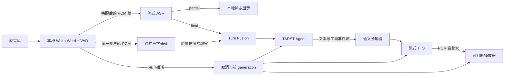
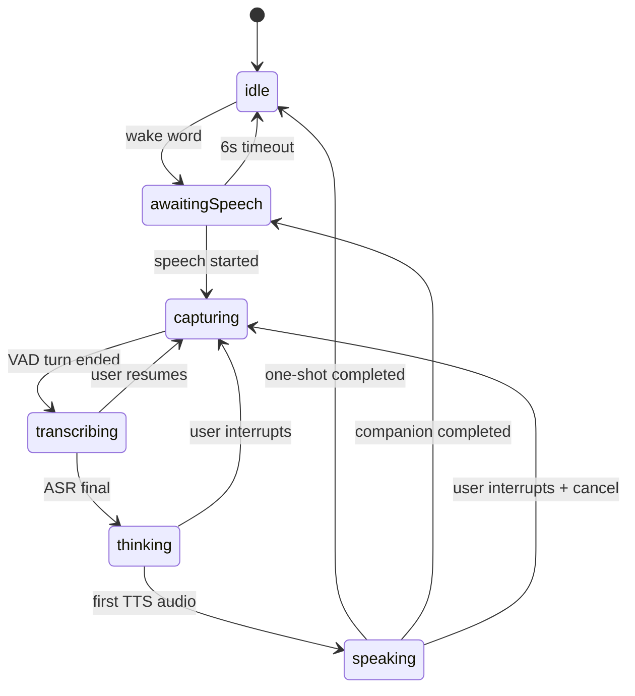

# TARST 流式 ASR、Agent 与 TTS 设计

状态：设计基线
日期：2026-08-15

## 1. 结论

TARST 第一版采用**模块化级联语音管线**：



这里的“流式”不是只给 LLM 打开 token streaming，而是六段都连续工作：

1. 麦克风音频连续送入 ASR；
2. ASR 连续返回临时转录，轮次结束后给出最终转录；
3. 独立声学通道并行提取当前用户轮的表达线索，但不把单次结果当作情绪事实；
4. Agent 连续返回文本、工具调用和状态事件；
5. TTS 按可朗读短句逐段合成，并连续返回音频块；
6. 播放器边收边播，用户插话时整条链路立即取消。

第一版不直接采用纯 speech-to-speech 作为唯一架构。纯实时语音模型可作为后续实验适配器，但 TARST 的会话状态、工具权限、记忆和日志必须由 TARST 自己掌握。

## 2. 为什么先用级联方案

级联方案会比端到端语音多几个步骤，但现阶段更适合 TARST：

- 能看到最终转录，便于验证 ASR、定位误解和形成可审计记忆；
- 工具调用只允许由最终文本触发，避免临时转录误操作；
- Agent 和 TTS 可以分别替换，声音难听时不必更换整个大脑；
- 更容易实现“一次性指令”和“陪伴式倾听”两种模式；
- 可以对 ASR、Agent、TTS 的延迟和错误分别诊断。

保留第二种实现：`RealtimeSpeechPipeline`。它接收音频并直接输出音频，适合以后比较自然度和极低延迟，但必须与级联管线实现相同的会话、取消和工具策略接口。

## 3. 组件边界

### 3.1 macOS 本地层

原生应用继续负责：

- 唯一麦克风所有权；
- 本地 Wake Word 与 Silero VAD；
- 唤醒提示、状态栏和用户可见状态；
- 音频输入门控与输出播放；
- 插话检测、整链路取消和隐私开关；
- Keychain 中的本机凭据或短期会话令牌；
- 不落盘的短音频环形缓冲。

不能让 ASR SDK、LiveKit SDK 和现有 `AVAudioEngine` 各自打开麦克风，否则会产生设备竞争、格式不一致和难以控制的回声。

### 3.2 Voice Session Bridge

Swift 侧增加统一会话接口，隔离本地状态机和云端/本地供应商：

```swift
protocol VoiceSession {
    func start(configuration: VoiceSessionConfiguration) async throws
    func sendAudio(_ frame: PCMFrame) async throws
    func finishUserTurn() async throws
    func cancel(generationID: UUID) async
    func events() -> AsyncThrowingStream<VoiceSessionEvent, Error>
    func close() async
}
```

建议提供两个实现：

- `CascadedVoiceSession`：ASR → Agent → TTS，作为 v1 默认；
- `RealtimeSpeechSession`：音频 → 实时语音模型 → 音频，作为对照实验。

传输层也独立成接口。开发期可以使用本机 WebSocket；进入跨设备或正式部署时可切换为 LiveKit/WebRTC，不修改业务状态机。

### 3.3 Agent 服务

Agent 服务负责：

- 对话上下文与 one-shot / companion 模式；
- 系统提示和 TARST 人格；
- 流式 LLM 响应；
- 工具选择、参数校验和执行编排；
- 生成用户可确认的记忆候选；
- 将结构化事件返回给 Swift 客户端。

第一版使用本机 Node.js/TypeScript Runtime，通过 stdin/stdout JSON Lines 与 Swift 通信。它使用普通 `openai` SDK 接入兼容该协议的模型，但不会使用 Agents SDK 接管编排。TARST 自己仍是策略、权限与记忆的所有者。

模型层通过 `LLMProvider` 隔离：优先试验 `MiniMax-M3`，并将 `MiniMax-M2.7-highspeed` 作为可通过 OpenAI-compatible API 调用的低延迟回退。M3 是否能直接使用该兼容协议必须通过独立 smoke test 确认；不应让业务逻辑假设此兼容性。

### 3.4 独立声学通道

声学通道与 ASR 并行消费同一段唤醒后、VAD 确认的当前用户轮 PCM。其职责是输出带置信度的声学观察，而不是诊断或给用户贴情绪标签：

```swift
struct AcousticObservation: Sendable {
    let quality: AcousticQuality
    let speechRate: Double?
    let pauseRatio: Double?
    let energy: Double?
    let pitchVariation: Double?
    let arousal: Double?
    let valence: Double?
    let confidence: Double
    let modelVersion: String
}
```

- `partial` ASR 和单帧声学结果都不能触发工具、记忆或高风险判断；
- 噪声、片段太短、低置信度或疑似多人声时返回“不判断”；
- Agent 只可将观察当作可被用户否定的回应线索，不能断言心理状态；
- 原始音频默认不落盘、不写日志、不作为长期记忆；
- 趋势记录和表达 coaching 仅在用户显式开启后启用，并且必须可查看、删除与完全清除。

### 3.5 工具与记忆策略层

`ToolPolicy` 必须位于模型与真实操作之间：

- ASR 临时转录不得触发工具；
- 只有最终转录和完整工具参数可以进入审批；
- 发消息、删除内容、付款等外部副作用默认需要确认；
- 打断或取消后，旧 generation 的工具提议自动失效；
- 记忆只保存用户确认的文本或结构化摘要，不保存原始音频；
- 供应商密钥不得写进 App 包、源码或 Git。

## 4. 事件协议

所有事件都携带 `sessionID`、`turnID`、`generationID` 和时间戳。`generationID` 是防止取消后旧音频继续播放的关键。

```swift
enum VoiceSessionEvent {
    case asrPartial(text: String)
    case asrFinal(text: String)
    case agentTextDelta(text: String)
    case agentTextCompleted(text: String)
    case toolCallProposed(ToolCall)
    case toolCallResult(ToolResult)
    case ttsAudio(AudioChunk)
    case responseCompleted
    case cancelled
    case failure(VoicePipelineError)
}
```

规则：

- `asrPartial` 只用于状态显示和低延迟预热，不写入对话历史；
- `asrFinal` 才提交给 Agent；
- `agentTextDelta` 先进入语义分句器，不能把单个 token 直接交给 TTS；
- 客户端只播放当前 `generationID` 的音频，迟到的数据一律丢弃；
- `responseCompleted` 只有在 Agent 完成且音频播放队列耗尽后才使 one-shot 回到 `idle`。

## 5. TTS：解决“回复很难听”

当前 `AVSpeechSynthesizer` 的 Tingting 只保留为离线故障回退，不再作为正常回复声音。新的正常链路必须包含：

### 5.1 语义分句，而非逐 token 朗读

Agent 的文本 delta 先进入 `SpeechChunker`：

- 遇到 `。！？；` 等自然边界立即提交；
- 没有标点时，中文约 12–30 字形成一个可朗读块；
- 首块最长等待约 250–400 ms，之后优先保持语义完整；
- Markdown、链接、代码和工具参数先转换成适合口语的表达；
- 极短语气词与下一短句合并，避免机械地一字一停。

这些参数是首轮设计值，后续用真实中文试听调整。

### 5.2 边合成边播放

新增 `StreamingSpeechSynthesizer` 和 `StreamingAudioPlayer`：

- TTS 返回首个 PCM 块后立刻播放，不等待整段音频；
- 播放器使用很小的抖动缓冲，避免网络波动导致爆音；
- 每个短句可提前排队，但队列不能过长，否则插话后还会“刹不住”；
- 用户开口时停止播放器、取消 TTS 请求并丢弃旧 generation；
- TTS 输出不能重新进入 ASR/VAD 输入链路；需要输出门控，并在后续评估系统级 AEC。

### 5.3 声音选择方法

不在未试听时拍板具体声音。第一轮至少准备 3 个支持中文流式输出的候选，用同一组文本做盲听：

- 简短确认：“好，我来看看。”
- 含数字日期的任务回复；
- 20–40 秒的陪伴式长回复；
- 中英混合的人名、产品名和缩写；
- 被用户中途打断的长句。

评价自然度、中文发音、情绪克制、首音延迟、长句稳定性和插话刹停。声音供应商通过适配器接入，不影响 Agent。

## 6. 状态机



内部可以同时进行 ASR、Agent 和 TTS，UI 状态只表达用户当前最需要知道的阶段。若 Agent 提议高风险工具，则进入 `awaitingConfirmation`，用户拒绝或超时后不执行。

## 7. 轮次与打断策略

### one-shot

唤醒一次，完成一次请求，回复播放完回到 `idle`。这是第一版默认模式。

### companion

回复后继续等待下一轮，不要求每轮重新说唤醒词。以下任一条件结束：

- 用户明确说“结束对话”；
- 长时间无输入；
- 用户手动暂停；
- 网络或 Agent 故障且恢复失败。

### barge-in

用户在 `thinking` 或 `speaking` 时开口：

1. 本地 VAD 确认不是短促噪声；
2. 递增 `generationID`；
3. 并发取消 Agent 生成、TTS 合成和播放器；
4. 清空未播放文本与音频队列；
5. 新音频进入当前用户轮次。

第一版继续让本地 VAD 成为打断与轮次结束的权威信号，服务端 turn detector 不同时自动提交轮次，避免双重判断。后续收集数据后再决定是否用语义 turn detector 补充。

## 8. 故障与回退

- ASR 断线：保留短时内存音频并有限重连；超过窗口则提示用户重说，不落盘；
- Agent 超时：播放简短本地提示，不伪造成功结果；
- TTS 失败：可切换备用 TTS；全部失败才使用系统声音；
- 播放失败：文字结果仍保留在调试界面，但 one-shot 正确收口；
- 任何取消：幂等执行，迟到事件不得恢复旧状态；
- companion 模式网络空闲时关闭昂贵流，音频仍由本地 Wake/VAD 门控。

## 9. 诊断指标

沿用当前“默认不保存音频”的诊断原则，增加每轮时间点：

- `wake_detected_at`
- `speech_started_at`
- `turn_ended_at`
- `first_asr_partial_at`
- `asr_final_at`
- `first_agent_delta_at`
- `first_tts_audio_at`
- `playback_started_at`
- `response_completed_at`
- `interrupted_at` / `cancel_completed_at`

由这些时间点计算 ASR 首字延迟、轮次结束至最终转录、Agent 首 token、TTS 首音、端到端首音和打断刹停时间。诊断文本默认可关闭；原始音频始终不保存。

首轮工程目标（不是供应商保证）：

- 用户说完到开始播放：目标 1.2 秒内，先以 2 秒内稳定完成为验收线；
- 插话到停止旧声音：目标 250 ms 内；
- 正常网络下流式播放无明显断裂或重复；
- 取消后绝不播放旧 generation 的音频；
- 工具不由临时转录触发。

## 10. 分阶段实施

### Phase A：协议与本地播放器

1. 拆掉业务代码对 `AVSpeechSynthesizer` 的直接依赖；
2. 建立 `VoiceSession`、事件协议和 generation 取消机制；
3. 建立流式音频播放器、队列和插话清空；
4. 用本地假 ASR/Agent/TTS 流验证状态机，不需要 API Key。

### Phase B：真实级联闭环

1. 接入一个流式 ASR；
2. 接入流式文本 Agent；
3. 接入至少两个流式中文 TTS 候选；
4. 完成中文盲听与延迟对照，选定默认声音；
5. one-shot 真实闭环验收。

### Phase C：Agent 能力

1. 加入工具策略、确认界面和取消语义；
2. 加入 companion 模式；
3. 加入用户可确认、审计和删除的记忆；
4. 接入可选的 Langfuse/等价观测适配器，但默认不上传音频。

### Phase D：实时语音对照

接入 `RealtimeSpeechSession`，与默认级联方案比较自然度、延迟、成本、转录可审计性和工具可靠性，再决定是否用于 companion 模式。

## 11. 当前明确不做

- 不把长期 API Key 硬编码进 macOS App；
- 不让云端服务持续接收未唤醒的环境音；
- 不让 ASR 临时转录执行工具或写入记忆；
- 不把原始音频当作默认日志；
- 不先绑定单一 ASR、LLM 或 TTS 供应商；
- 不在没有中文盲听数据前宣称某个声音最好。

## 12. 设计参考

- [OpenAI Voice agents：端到端实时语音与级联语音管线](https://developers.openai.com/api/docs/guides/voice-agents)
- [OpenAI Realtime transcription](https://developers.openai.com/api/docs/guides/realtime-transcription)
- [OpenAI Text to speech：实时音频流](https://developers.openai.com/api/docs/guides/text-to-speech)
- [LiveKit Agents：STT–LLM–TTS、Realtime 与 Half-cascade](https://docs.livekit.io/agents/models/pipelines/)
- [LiveKit Agents：Turn detection 与 interruption](https://docs.livekit.io/agents/logic/turns/)
